# DHCP Troubleshooting Lab | Cisco Packet Tracer

## Project Overview

This project demonstrates the configuration and troubleshooting of DHCP within a small office network using Cisco Packet Tracer.

I configured a server to automatically assign IPv4 addresses to client devices, then introduced several DHCP related faults to practise identifying, isolating and resolving common connectivity problems.

The lab focuses on DHCP configuration, IP addressing, client connectivity and structured network troubleshooting.

---

## Network Topology


### Network Devices

- 1 Cisco 2960 Switch
- 1 DHCP Server
- 2 Client PCs

### Network

```text
Network:          192.168.50.0/24
DHCP Server:      192.168.50.2
Default Gateway:  192.168.50.1
Subnet Mask:      255.255.255.0
```

---

## DHCP Configuration

The DHCP server was configured with the following pool:

```text
Pool Name:        serverPool
Default Gateway:  192.168.50.1
DNS Server:       8.8.8.8
Start IP Address: 192.168.50.100
Subnet Mask:      255.255.255.0
Maximum Users:    50
```

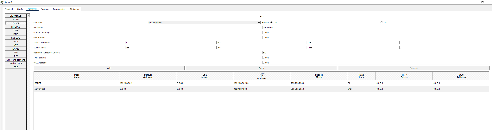

Client PCs were configured to obtain their network settings automatically using DHCP.

---

## Baseline DHCP Testing

After configuring the DHCP server, I verified that the client devices could automatically receive valid network configurations.

A correctly configured client received an address from the `192.168.50.0/24` network.

I used:

```text
ipconfig
```

to verify the assigned IP address, subnet mask and default gateway.

I then tested connectivity to the DHCP server using:

```text
ping 192.168.50.2
```

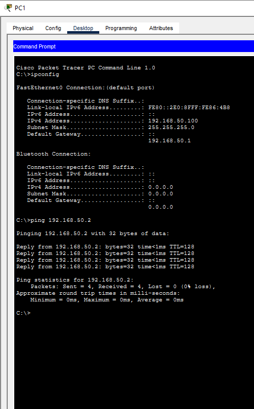

---

# Fault 1: DHCP Service Disabled

## Problem

The DHCP service was deliberately switched off on the server.

When PC1 attempted to request an address automatically, the DHCP request failed.

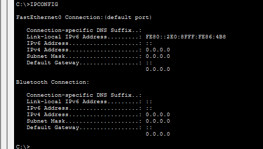

## Investigation

I checked the DHCP service on the server and identified that it had been disabled.

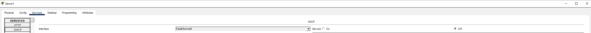

## Resolution

I enabled the DHCP service again and forced PC1 to request a new address.

The client successfully received a valid IP configuration.

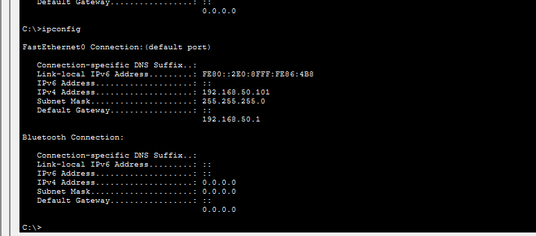

---

# Fault 2: Incorrect DHCP Network

## Problem

The DHCP configuration was changed so the client received an address from the wrong network.

Instead of receiving an address from:

```text
192.168.50.0/24
```

the client received an address from another subnet.

Using:

```text
ipconfig
```

I identified that the client IP address did not match the intended network.

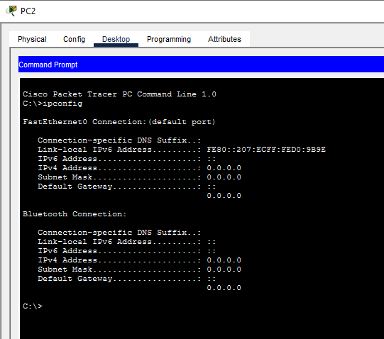

## Connectivity Test

I attempted to reach the DHCP server:

```text
ping 192.168.50.2
```

The test failed because the client was configured on the wrong network.

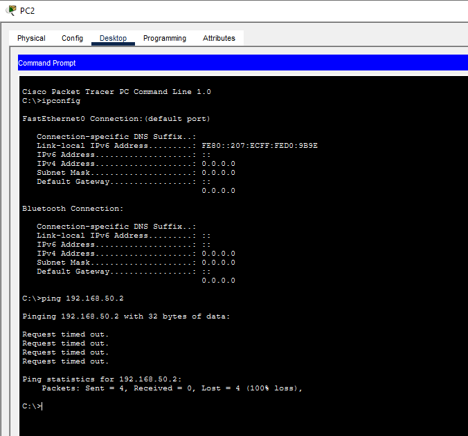

## Resolution

I corrected the DHCP pool so addresses were issued from:

```text
192.168.50.100
```

with the subnet mask:

```text
255.255.255.0
```

The client then received a valid address and connectivity was restored.

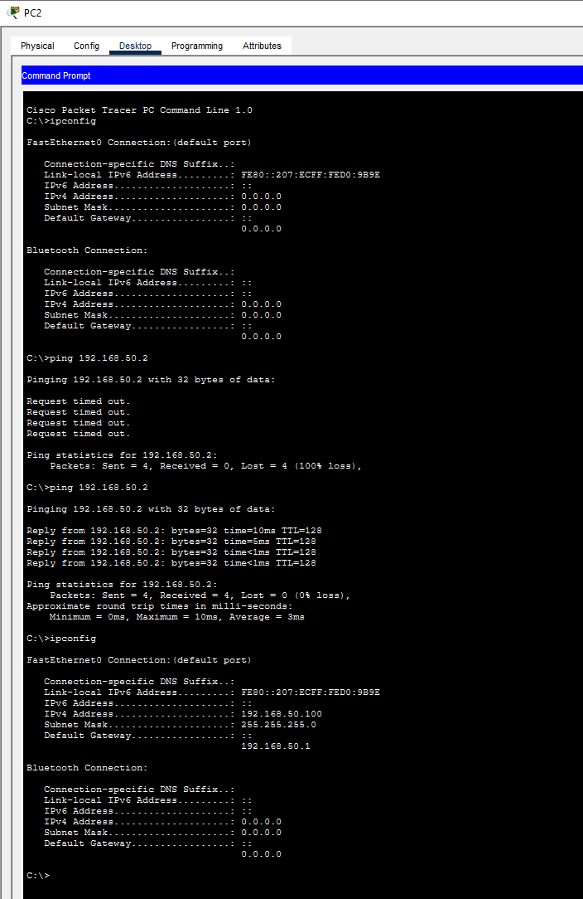

---

# Fault 3: Incorrect Subnet Mask

## Problem

The DHCP pool was deliberately configured with an incorrect subnet mask.

The client received incorrect network information through DHCP.

I identified the issue using:

```text
ipconfig
```

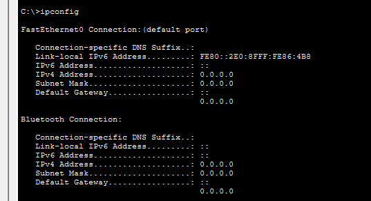

## Resolution

The DHCP pool subnet mask was restored to:

```text
255.255.255.0
```

The client then requested a new DHCP configuration and received the correct network settings.

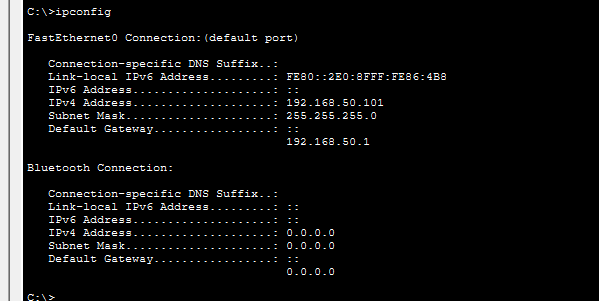

---

# Fault 4: DHCP Pool Exhaustion

## Problem

The DHCP pool was restricted so that only one client could receive an IP address.

After the available lease was allocated, another client was unable to obtain an address.

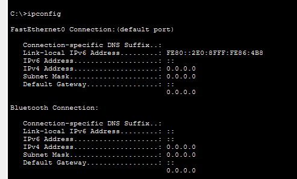

## Resolution

I increased the number of available DHCP addresses.

The second client was then able to successfully obtain a valid IP address from the DHCP server.

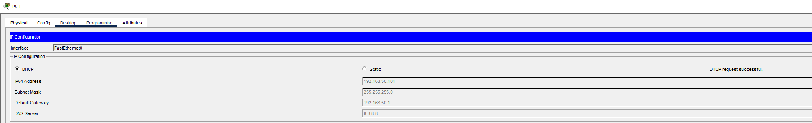

---

## Troubleshooting Methodology

I used a structured process throughout the lab:

```text
Identify
↓
Check Client Configuration
↓
Test Connectivity
↓
Inspect DHCP Settings
↓
Isolate the Fault
↓
Correct the Configuration
↓
Renew DHCP
↓
Verify Connectivity
```

This helped ensure that each issue was diagnosed before configuration changes were made.

---

## Commands and Tools Used

- `ipconfig`
- `ping`
- DHCP client configuration
- DHCP pool configuration
- Cisco Packet Tracer
- Basic connectivity testing

---

## Skills Demonstrated

- DHCP configuration
- IPv4 addressing
- Subnetting
- DHCP pools
- Automatic IP assignment
- Client server networking
- IP configuration analysis
- Connectivity testing
- Fault isolation
- DHCP troubleshooting
- Structured troubleshooting
- Cisco Packet Tracer

---

## Project Outcome

This project strengthened my understanding of how DHCP automatically provides network configuration to client devices.

It also provided practical experience diagnosing common DHCP issues including disabled services, incorrect address pools, incorrect subnet masks and exhausted DHCP pools.

The lab reinforced the importance of checking both client configuration and server side DHCP settings when diagnosing network connectivity problems.

---

## Project File

The complete Cisco Packet Tracer project is included in this repository.

```text
DHCPTroubleshootingLab.pkt
```

Cisco Packet Tracer is required to open the `.pkt` file.
