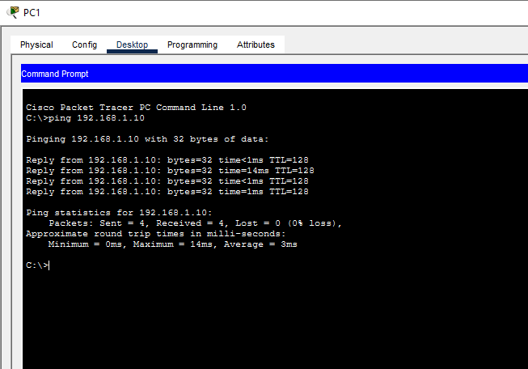
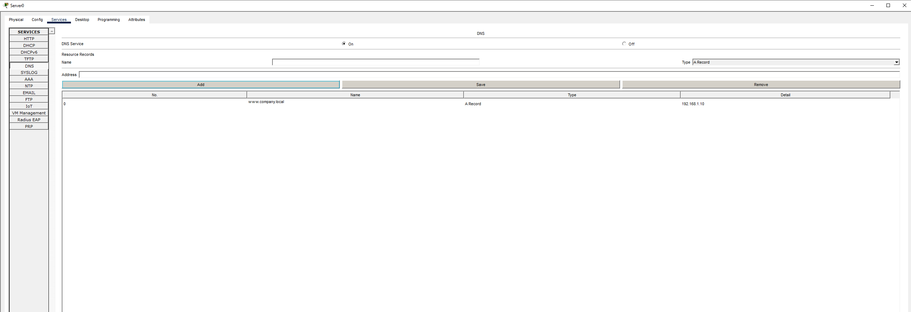
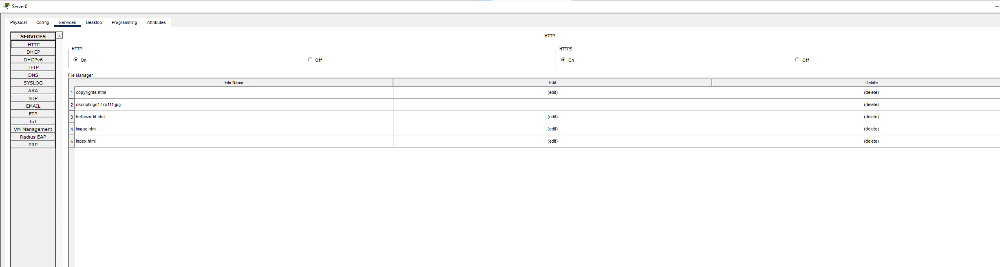
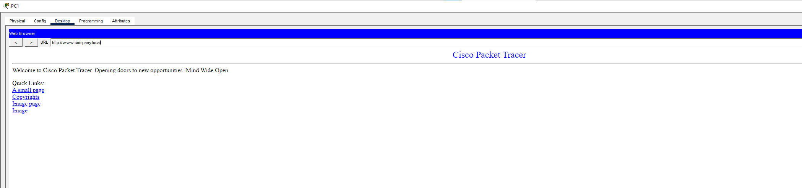

# DNS and Web Server Lab | Cisco Packet Tracer

## Project Overview

This project demonstrates a simple client server network using Cisco Packet Tracer.

I configured a DNS server and web server so client PCs could access a website using a hostname instead of remembering the server IP address.

The project demonstrates basic networking, DNS name resolution, HTTP services and connectivity testing.

---

## Network Topology


---

## Network Design

### Server

```text
IP Address:      192.168.1.10
Subnet Mask:     255.255.255.0
DNS Server:      192.168.1.10
```

### PC1

```text
IP Address:      192.168.1.20
Subnet Mask:     255.255.255.0
DNS Server:      192.168.1.10
```

### PC2

```text
IP Address:      192.168.1.21
Subnet Mask:     255.255.255.0
DNS Server:      192.168.1.10
```

---

## Basic Connectivity Testing

Before configuring DNS, I confirmed that the client devices could communicate with the server.

From PC1:

```text
ping 192.168.1.10
```

Successful replies confirmed that the underlying network was working.



---

## DNS Configuration

I enabled the DNS service on SERVER1 and created an A record.

```text
Name:    www.company.local
Address: 192.168.1.10
```

This allows client devices to resolve the hostname:

```text
www.company.local
```

to:

```text
192.168.1.10
```



---

## Web Server Configuration

I enabled the HTTP service on SERVER1.

The server was configured to host a basic internal webpage.



---

## Website Testing by IP Address

I first tested the web server directly using its IP address:

```text
http://192.168.1.10
```

The webpage loaded successfully.


---

## Website Testing by Hostname

I then tested the same website using the DNS hostname:

```text
http://www.company.local
```

The webpage loaded successfully, confirming that DNS name resolution was working.



---

## DNS Resolution Testing

I also tested DNS from the command prompt using:

```text
ping www.company.local
```

The hostname successfully resolved to:

```text
192.168.1.10
```

and the server returned successful ping responses.


---

## Skills Demonstrated

- IPv4 addressing
- Basic LAN configuration
- DNS configuration
- DNS A records
- Name resolution
- HTTP services
- Client server networking
- Connectivity testing
- `ping`
- Basic troubleshooting
- Cisco Packet Tracer

---

## Project Outcome

This project helped strengthen my understanding of how DNS allows users to access network resources using readable hostnames instead of IP addresses.

It also provided practical experience configuring a server to provide both DNS and HTTP services and testing those services from multiple client devices.

---

## Project File

The complete Cisco Packet Tracer project is included in this repository.

```text
DNSWebServerLab.pkt
```

Cisco Packet Tracer is required to open the `.pkt` file.
