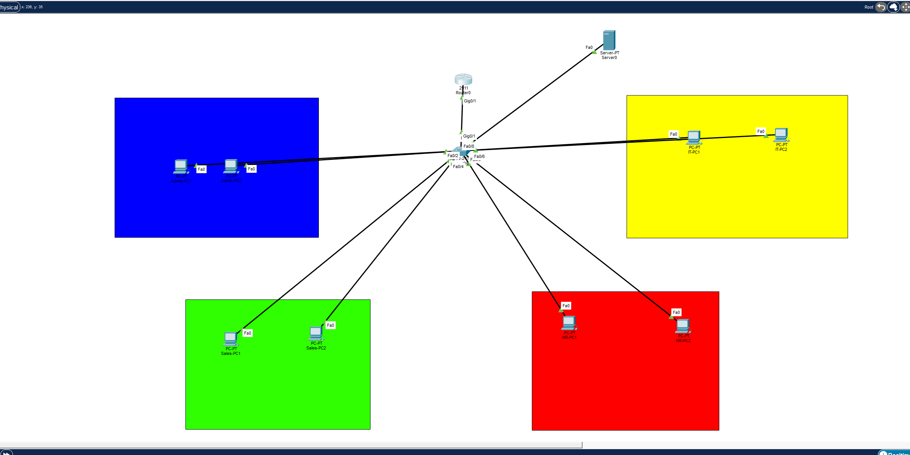
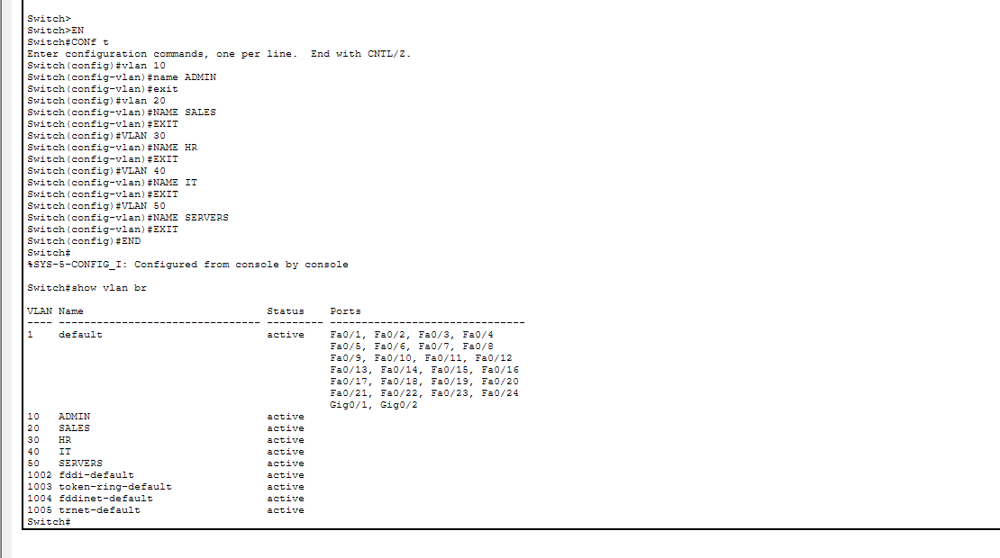
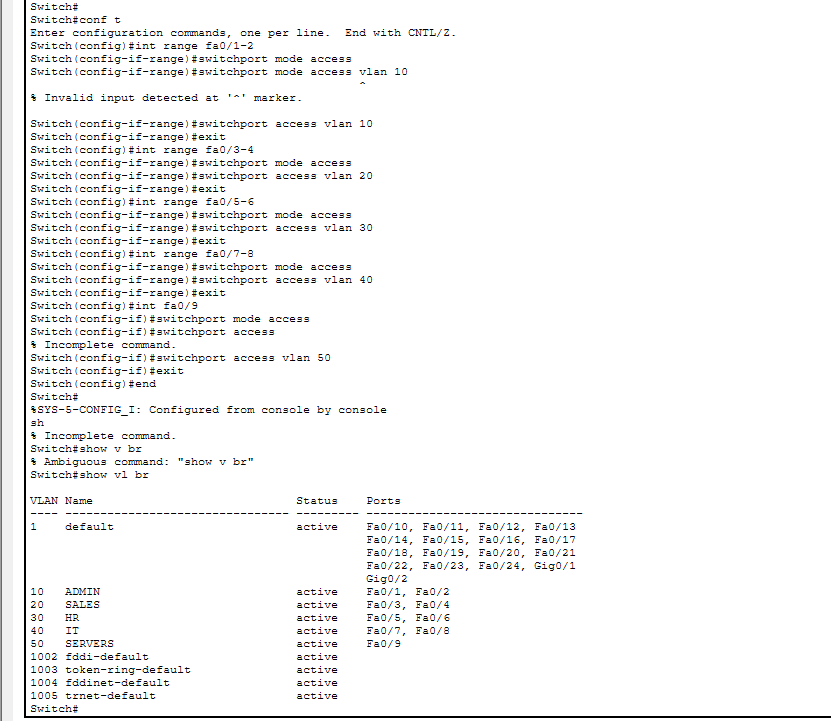
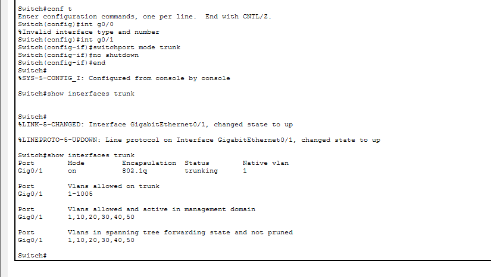
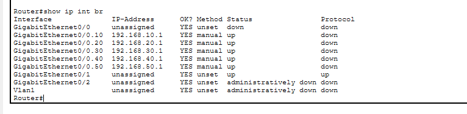
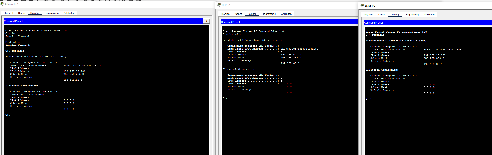
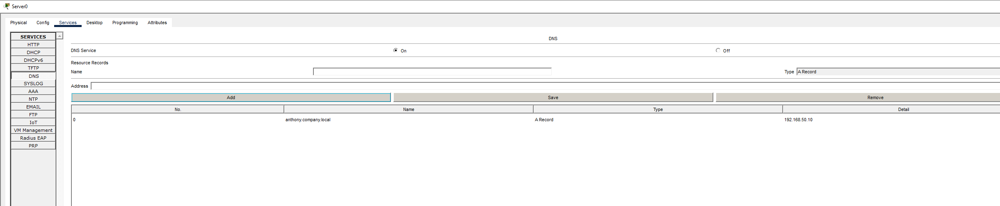
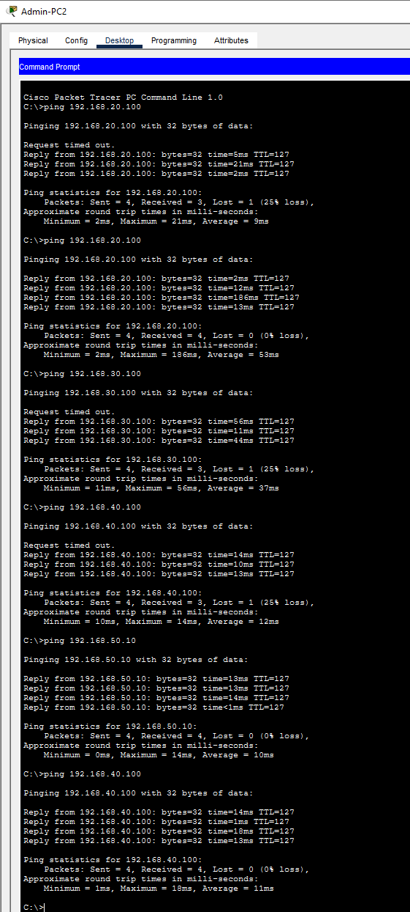
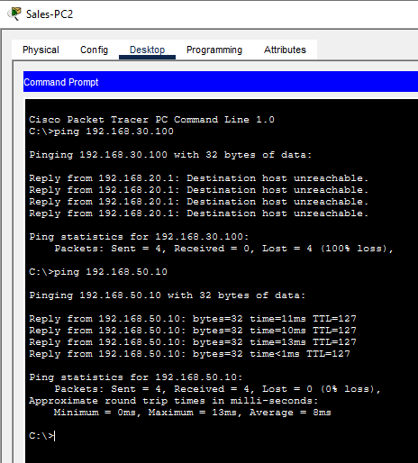
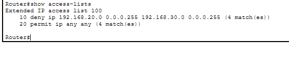

# Multi Department Company Network | Cisco Packet Tracer

## Project Overview

This project demonstrates the design and configuration of a multi department company network using Cisco Packet Tracer.

The network was segmented into separate VLANs for Admin, Sales, HR, IT and Servers.

I configured VLANs, 802.1Q trunking, router-on-a-stick, DHCP relay, DNS, HTTP services, inter-VLAN routing and basic access control to create a more realistic business network environment.

---

## Network Topology



---

## VLAN Design

| VLAN | Department | Network | Default Gateway |
|---|---|---|---|
| 10 | Admin | `192.168.10.0/24` | `192.168.10.1` |
| 20 | Sales | `192.168.20.0/24` | `192.168.20.1` |
| 30 | HR | `192.168.30.0/24` | `192.168.30.1` |
| 40 | IT | `192.168.40.0/24` | `192.168.40.1` |
| 50 | Servers | `192.168.50.0/24` | `192.168.50.1` |

---

## VLAN Configuration

I created five VLANs on SW1:

```text
vlan 10
name ADMIN

vlan 20
name SALES

vlan 30
name HR

vlan 40
name IT

vlan 50
name SERVERS
```

I verified the configuration using:

```text
show vlan brief
```



---

## Department Port Assignments

The switch ports were assigned to their relevant departments.

### Admin

```text
interface range fa0/1 - 2
switchport mode access
switchport access vlan 10
```

### Sales

```text
interface range fa0/3 - 4
switchport mode access
switchport access vlan 20
```

### HR

```text
interface range fa0/5 - 6
switchport mode access
switchport access vlan 30
```

### IT

```text
interface range fa0/7 - 8
switchport mode access
switchport access vlan 40
```

### Servers

```text
interface fa0/9
switchport mode access
switchport access vlan 50
```



---

## Trunk Configuration

The link between the switch and router was configured as an 802.1Q trunk.

```text
interface g0/1
switchport mode trunk
```

I verified the trunk using:

```text
show interfaces trunk
```



---

## Router-on-a-Stick

The router was configured with one subinterface per VLAN.

### Admin

```text
interface g0/1.10
encapsulation dot1Q 10
ip address 192.168.10.1 255.255.255.0
```

### Sales

```text
interface g0/1.20
encapsulation dot1Q 20
ip address 192.168.20.1 255.255.255.0
```

### HR

```text
interface g0/1.30
encapsulation dot1Q 30
ip address 192.168.30.1 255.255.255.0
```

### IT

```text
interface g0/1.40
encapsulation dot1Q 40
ip address 192.168.40.1 255.255.255.0
```

### Servers

```text
interface g0/1.50
encapsulation dot1Q 50
ip address 192.168.50.1 255.255.255.0
```



---

## DHCP Configuration

SERVER1 was configured to provide DHCP services to each department.

Example Admin pool:

```text
Pool Name:        ADMIN
Default Gateway:  192.168.10.1
DNS Server:       192.168.50.10
Start IP Address: 192.168.10.100
Subnet Mask:      255.255.255.0
Maximum Users:    50
```

Equivalent DHCP pools were created for Sales, HR and IT.


---

## DHCP Relay

Because the DHCP server is located in VLAN 50, the router was configured to relay DHCP requests from the other VLANs.

Example:

```text
interface g0/1.10
ip helper-address 192.168.50.10
```

The same helper address was configured on VLANs 20, 30 and 40.

This allowed DHCP requests to cross VLAN boundaries and reach the central server.



---

## DNS Configuration

SERVER1 was also configured as the company DNS server.

A DNS A record was created:

```text
Name:    intranet.company.local
Address: 192.168.50.10
```



---

## Company Intranet

HTTP services were enabled on SERVER1 and a simple internal company webpage was created.

Users could access the company intranet using:

```text
http://intranet.company.local
```


---

## Inter-VLAN Connectivity

I tested communication between devices in different departments.

Example tests included:

```text
ping 192.168.20.100
ping 192.168.30.100
ping 192.168.40.100
ping 192.168.50.10
```

Successful replies confirmed that inter-VLAN routing was working correctly.



---

## Basic Access Control

An ACL was configured to prevent Sales users from directly accessing the HR network while still allowing other network communication.

```text
access-list 100 deny ip 192.168.20.0 0.0.0.255 192.168.30.0 0.0.0.255
access-list 100 permit ip any any
```

The ACL was applied inbound on the Sales VLAN:

```text
interface g0/1.20
ip access-group 100 in
```

A Sales to HR ping failed as expected.



I verified the ACL using:

```text
show access-lists
```



---

## Skills Demonstrated

- VLAN configuration
- Network segmentation
- Access port configuration
- 802.1Q trunking
- Router-on-a-stick
- Inter-VLAN routing
- DHCP
- DHCP relay
- DNS
- HTTP services
- ACL configuration
- IPv4 addressing
- Subnetting
- Cisco IOS
- Connectivity testing
- Network troubleshooting
- Cisco Packet Tracer

---

## Project Outcome

This project combined several networking concepts into one realistic business network.

It strengthened my understanding of how departments can be segmented using VLANs while still accessing shared infrastructure such as DHCP, DNS and internal web services.

The project also introduced basic network access control by restricting communication between departments using an ACL.

---

## Project File

The complete Cisco Packet Tracer project is included in this repository.

```text
MultiDepartmentCompanyNetwork.pkt
```

Cisco Packet Tracer is required to open the `.pkt` file.
