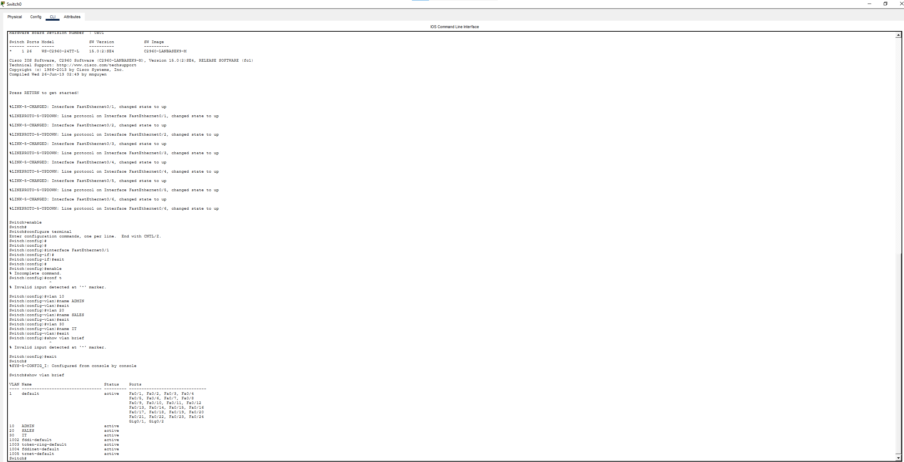
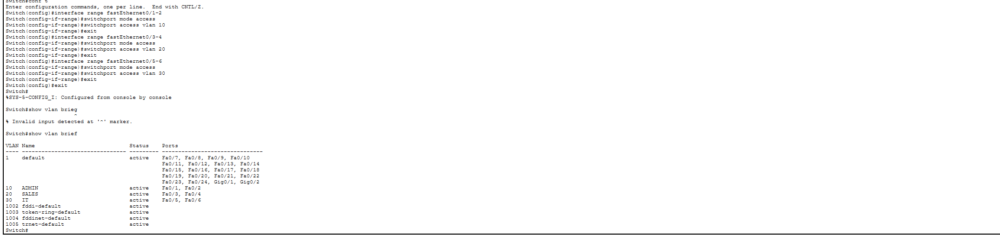
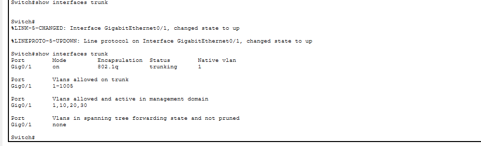
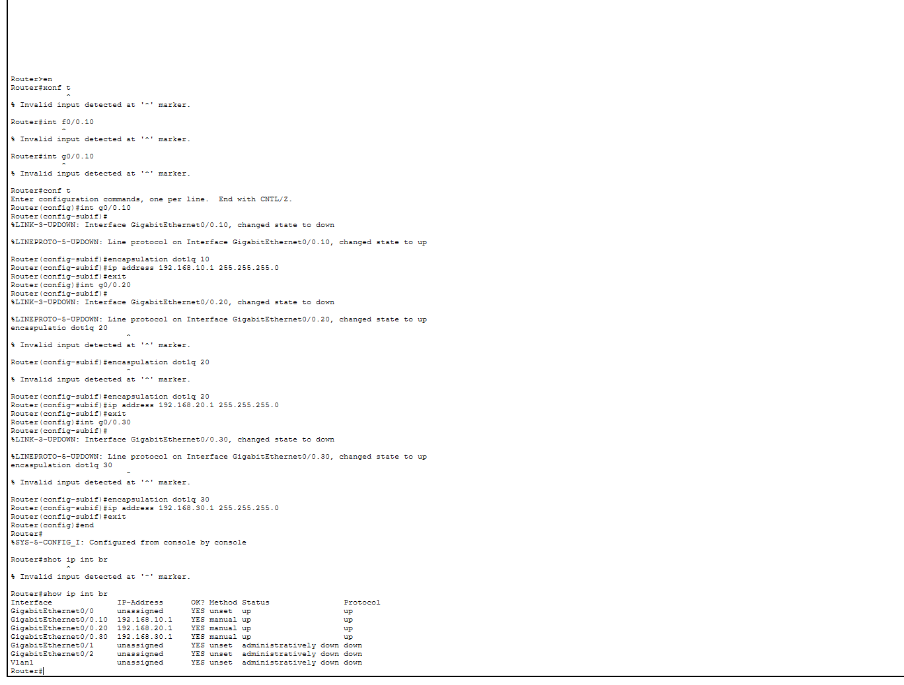
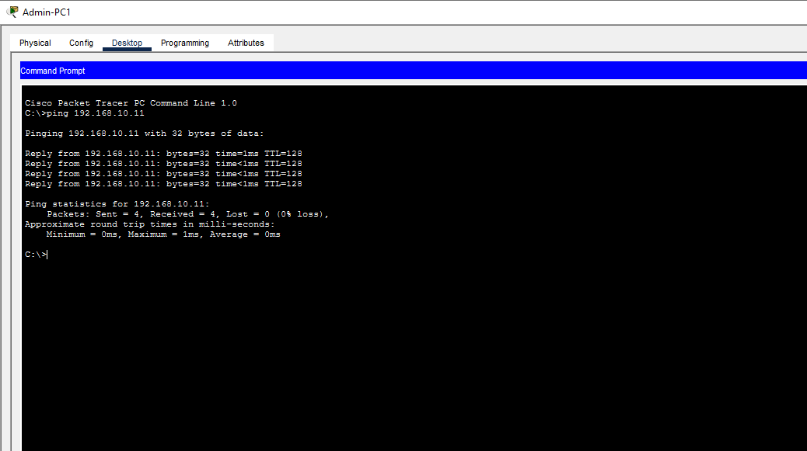
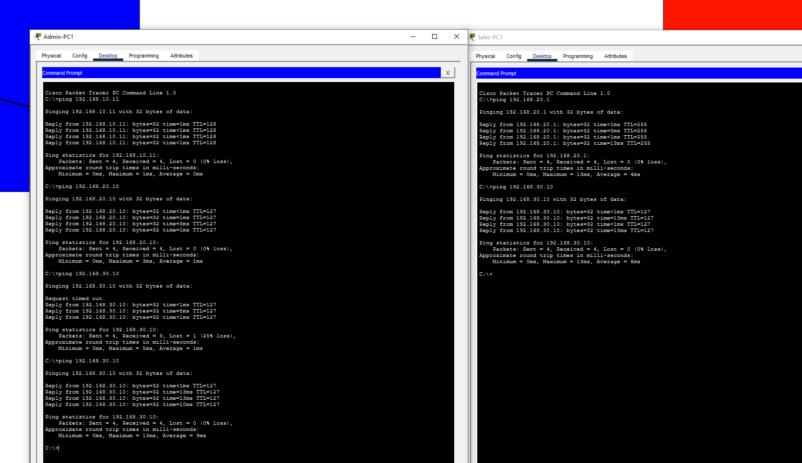
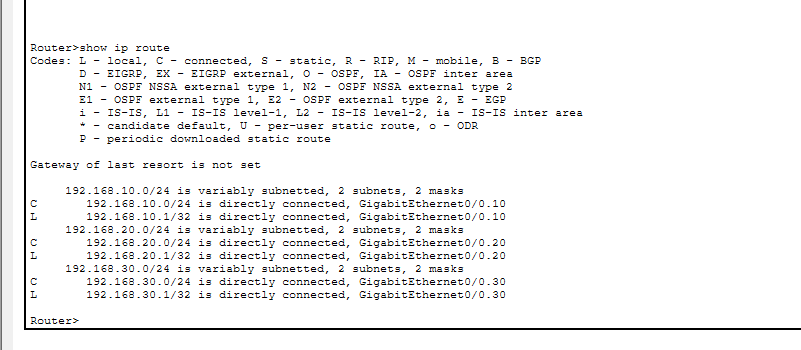
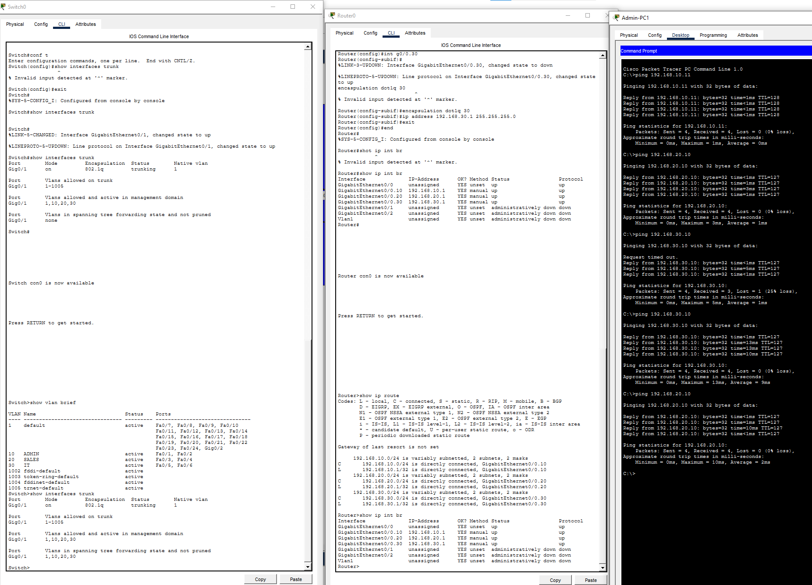

# Office VLAN Project | Cisco Packet Tracer

## Project Overview

This project demonstrates the design and configuration of a segmented office network using VLANs in Cisco Packet Tracer.

The network was divided into three departments:

- Admin
- Sales
- IT

Each department was placed into its own VLAN and subnet.

I then configured router-on-a-stick to enable communication between the VLANs using 802.1Q trunking and router subinterfaces.

---

## Network Topology


---

## VLAN Design

| VLAN | Department | Network | Default Gateway |
|---|---|---|---|
| VLAN 10 | Admin | `192.168.10.0/24` | `192.168.10.1` |
| VLAN 20 | Sales | `192.168.20.0/24` | `192.168.20.1` |
| VLAN 30 | IT | `192.168.30.0/24` | `192.168.30.1` |

---

## Device Addressing

### Admin VLAN

Admin PC1

```text
IP Address:      192.168.10.10
Subnet Mask:     255.255.255.0
Default Gateway: 192.168.10.1
```

Admin PC2

```text
IP Address:      192.168.10.11
Subnet Mask:     255.255.255.0
Default Gateway: 192.168.10.1
```

### Sales VLAN

Sales PC1

```text
IP Address:      192.168.20.10
Subnet Mask:     255.255.255.0
Default Gateway: 192.168.20.1
```

Sales PC2

```text
IP Address:      192.168.20.11
Subnet Mask:     255.255.255.0
Default Gateway: 192.168.20.1
```

### IT VLAN

IT PC1

```text
IP Address:      192.168.30.10
Subnet Mask:     255.255.255.0
Default Gateway: 192.168.30.1
```

IT PC2

```text
IP Address:      192.168.30.11
Subnet Mask:     255.255.255.0
Default Gateway: 192.168.30.1
```

---

# VLAN Configuration

I created three VLANs on the switch:

```text
vlan 10
name ADMIN

vlan 20
name SALES

vlan 30
name IT
```

I then verified the VLANs using:

```text
show vlan brief
```



---

# Access Port Configuration

The switch ports were assigned to the correct VLANs.

### Admin Ports

```text
interface range fastEthernet0/1 - 2
switchport mode access
switchport access vlan 10
```

### Sales Ports

```text
interface range fastEthernet0/3 - 4
switchport mode access
switchport access vlan 20
```

### IT Ports

```text
interface range fastEthernet0/5 - 6
switchport mode access
switchport access vlan 30
```

I verified the port assignments using:

```text
show vlan brief
```



---

# Trunk Configuration

The link between the switch and router was configured as an 802.1Q trunk.

```text
interface gigabitEthernet0/1
switchport mode trunk
```

I verified the trunk using:

```text
show interfaces trunk
```



---

# Router-on-a-Stick Configuration

The router physical interface was enabled:

```text
interface gigabitEthernet0/0
no shutdown
```

I then created one subinterface for each VLAN.

### VLAN 10 Admin

```text
interface gigabitEthernet0/0.10
encapsulation dot1Q 10
ip address 192.168.10.1 255.255.255.0
```

### VLAN 20 Sales

```text
interface gigabitEthernet0/0.20
encapsulation dot1Q 20
ip address 192.168.20.1 255.255.255.0
```

### VLAN 30 IT

```text
interface gigabitEthernet0/0.30
encapsulation dot1Q 30
ip address 192.168.30.1 255.255.255.0
```

I verified the router interfaces using:

```text
show ip interface brief
```



---

# Same VLAN Connectivity Testing

I first confirmed that devices within the same VLAN could communicate successfully.

Example:

```text
ping 192.168.10.11
```

This confirmed communication between devices within the Admin VLAN.



---

# Inter-VLAN Routing Testing

After configuring the trunk and router subinterfaces, I tested communication between different VLANs.

From an Admin device:

```text
ping 192.168.20.10
```

This tested connectivity to the Sales VLAN.

I also tested:

```text
ping 192.168.30.10
```

This tested connectivity to the IT VLAN.

Successful replies confirmed that inter-VLAN routing was working correctly.



---

# Routing Table Verification

I checked the router routing table using:

```text
show ip route
```

The router showed all three networks as directly connected:

```text
192.168.10.0/24
192.168.20.0/24
192.168.30.0/24
```



---

# Final Verification

I completed a final check of the network using:

```text
show vlan brief
show interfaces trunk
show ip interface brief
```

I also performed end-to-end ping tests between devices in different VLANs.

The final tests confirmed:

- VLANs were created correctly
- Access ports were assigned correctly
- The trunk link was operational
- Router subinterfaces were configured correctly
- Devices could communicate within their own VLAN
- Devices could communicate between VLANs



---

# Skills Demonstrated

- VLAN configuration
- Network segmentation
- IPv4 addressing
- Subnetting
- Access port configuration
- 802.1Q trunking
- Router-on-a-stick
- Router subinterfaces
- Inter-VLAN routing
- Cisco IOS commands
- Switch configuration
- Router configuration
- Network connectivity testing
- Troubleshooting
- Cisco Packet Tracer

---

# Project Outcome

This project helped strengthen my understanding of how VLANs are used to logically separate departments within an organisation.

I also gained practical experience configuring access ports, trunk links and router subinterfaces to allow controlled communication between separate VLANs.

The project demonstrates how network segmentation can be used to create a more structured and scalable office network while still allowing communication between departments when required.

---

# Project File

The complete Cisco Packet Tracer project is included in this repository.

```text
OfficeVLANProject.pkt
```

Cisco Packet Tracer is required to open the `.pkt` file.
